# Widgets for WingetUI

This repository contains the code of a set of Windows Widgets that can be used to interact with WingetUI. The widgets are available on the **Windows Widgets** pane and on **Dev Home**.

WingetUI Widgets are **ONLY** compatible with Windows 11

 

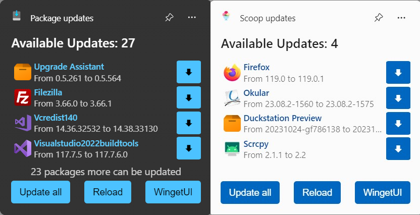</img>

Currently, the widgets allow viewing available updates, updating specific packages and bulk-updating everything. A widget for each Package Manager is available, as well as a widget that will list every available package without source distinction.

## More Screenshots:

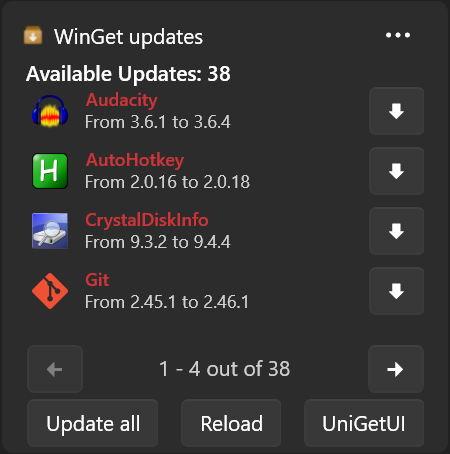</img>
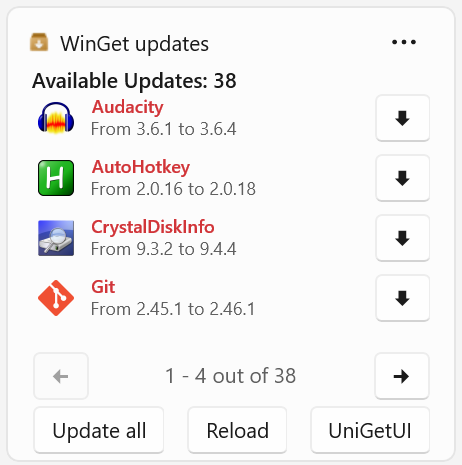</img>

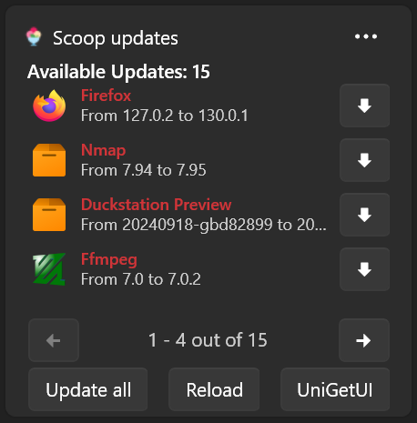</img>
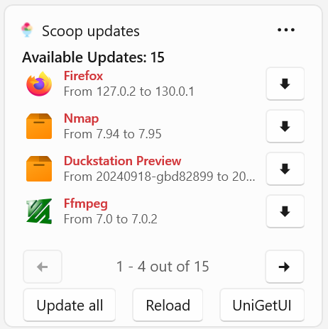</img>

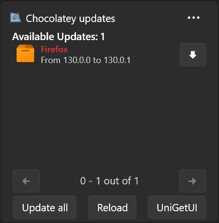</img>
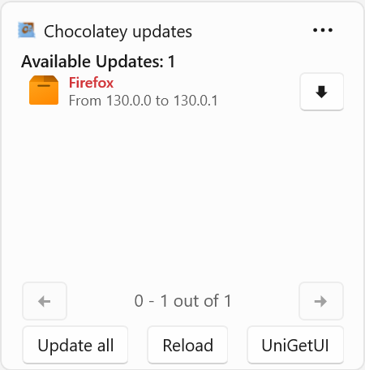</img>

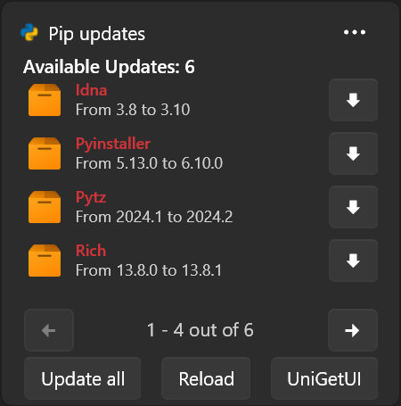</img>
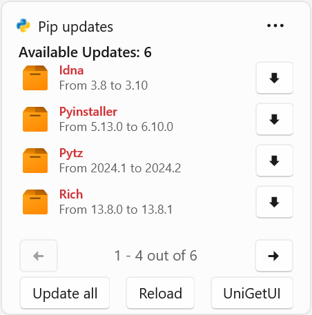</img>

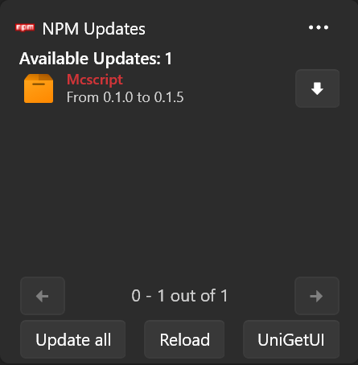</img>
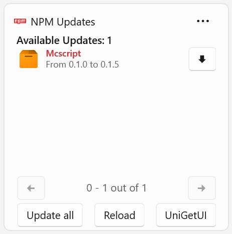</img>

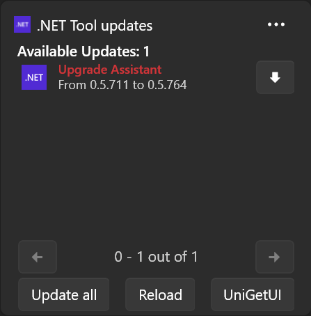</img>
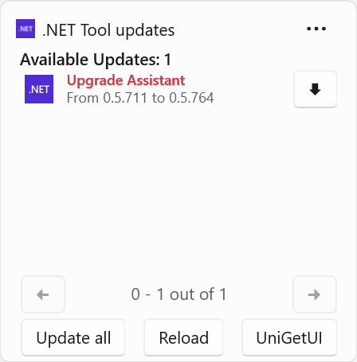</img>

  
