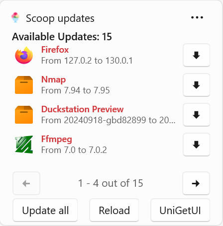

# WingetUI Widgets (Preview)
**This program is still under development**

This repository contains the code of a set of Windows Widgets that can be used to interact with WingetUI. The widgets are available on the **Windows Widgets** pane and on **Dev Home**[^1].

> [!WARNING]
> These widgets require a beta version of WingetUI. You can get WingetUI Beta here: [WingetUI 2.1.2 beta](https://github.com/marticliment/WingetUI/releases/download/2.1.2-beta/WingetUI.Installer.exe) .

  

</img>
</img>

Currently, the widgets allow viewing available updates, updating specific packages and bulk-updating everything. A widget for each Package Manager is available, as well as a widget that will list every available package without source distinction.

## More Screenshots:

</img>
</img>

</img>
</img>

</img>
</img>

</img>
</img>

</img>
</img>

</img>
</img>

  

[^1]: Dev Home widget support is still experimental, and some widgets may not render properly.
